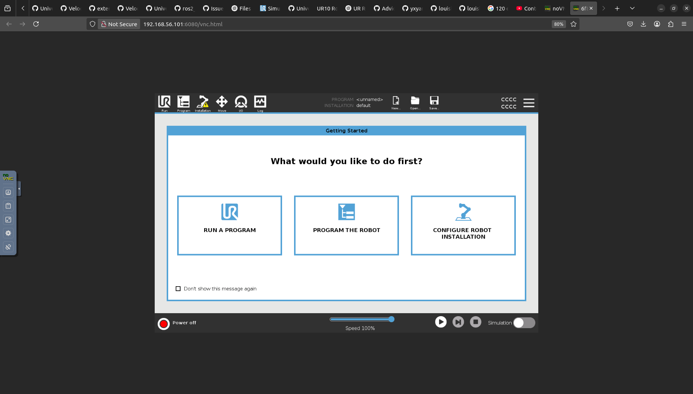
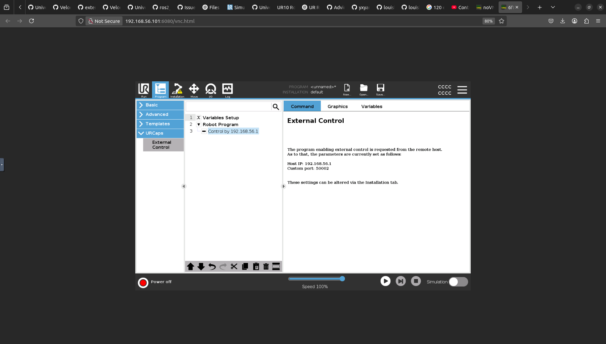
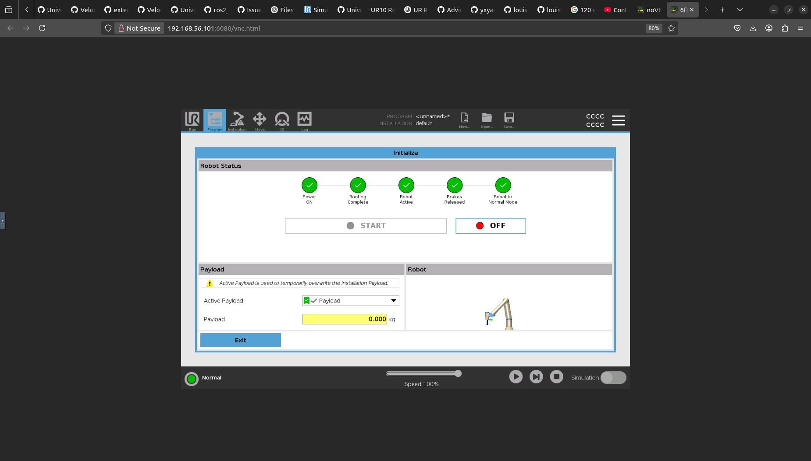
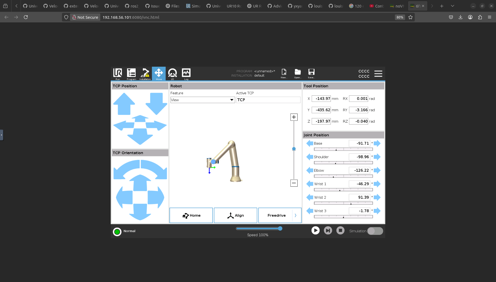
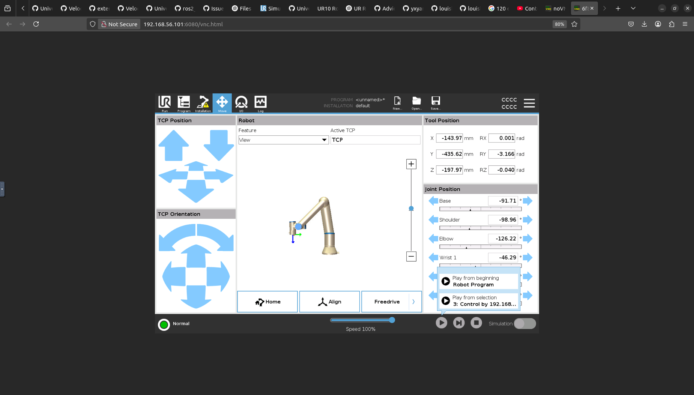

## Overview

This guide details the modifications made to the `isaaclab_ur_reach_sim2real` codebase to make it compatible with **ROS 2 Jazzy Jalisco** running on **Ubuntu 24.04**. 

In addition to syntax and API changes, it covers the environmental configuration tweaks needed to successfully run the task scripts from a separate terminal containing virtual environments (e.g., PyTorch or IsaacLab).

## 1. Codebase Syntax and API Changes

### Updating Controller State Topics
Between ROS 2 Humble and Jazzy, the default controller state topic for the scaled joint trajectory controller changed.
In `python/run_task.py`, the `STATE_TOPIC` must be updated:
```python
# Old (ROS 2 Humble)
STATE_TOPIC = '/scaled_joint_trajectory_controller/state'

# New (ROS 2 Jazzy)
STATE_TOPIC = '/scaled_joint_trajectory_controller/controller_state'
```

### Adapting to `control_msgs` Changes
The `JointTrajectoryControllerState` message definition changed in ROS 2 Jazzy. The `actual` field was deprecated and renamed to `feedback`.
In `python/run_task.py`, inside the `sub_callback` function, update the attributes used to access joint positions and velocities:
```python
# Old (ROS 2 Humble)
joint_pos = msg.actual.positions[i]
self.robot.update_joint_state(msg.actual.positions, msg.actual.velocities)

# New (ROS 2 Jazzy)
joint_pos = msg.feedback.positions[i]
self.robot.update_joint_state(msg.feedback.positions, msg.feedback.velocities)
```

## 2. Hardcoded Configuration Paths

The pre-trained policy loader uses hardcoded paths to initialize the model and environment parameters. These need to be updated to match the local workspace structure on the new machine.

In `python/robots/ur.py`:
```python
# Update these to match your local repository clone path
self.load_policy(
    "/home/<YOUR_USER>/isaaclab_ur_reach_sim2real/sample/ur_reach/ur_reach_policy.pt",
    "/home/<YOUR_USER>/isaaclab_ur_reach_sim2real/sample/ur_reach/ur_reach_env.yaml",
)
```

## 3. Environment and Terminal Setup

To run the task scripts from another terminal successfully, you must handle Python dependencies and the integration between deep learning environments (venv/conda) and the ROS 2 workspace.

### Dependencies
Create a virtual environment and load the necessary dependencies (`torch`, `torchvision`, `torchaudio`, `numpy`, `pyyaml`). 
```bash
python3 -m venv pytorch_env
source pytorch_env/bin/activate
pip install torch torchvision torchaudio numpy pyyaml
```

### Resolving Module Not Found Errors (PYTHONPATH)
When running within an isolated virtual environment (like a conda env for IsaacLab or a venv for PyTorch), the ROS 2 Python packages might not be correctly recognized even after sourcing the setup file. 

To allow task scripts to run seamlessly from another terminal, source ROS 2 Jazzy and explicitly append its `site-packages` to your `PYTHONPATH`:

```bash
# Sourcing ROS 2 Jazzy
source /opt/ros/jazzy/setup.bash

# Ensure Python 3.12 (the default for Ubuntu 24.04/Jazzy) sees the ROS 2 packages
export PYTHONPATH=$PYTHONPATH:/opt/ros/jazzy/lib/python3.12/site-packages

# Navigate and run your task
cd /path/to/isaaclab_ur_reach_sim2real/python/
python3 run_task.py
```
This ensures standard tools like `rclpy` are successfully imported within your deep learning environment.

## 4. Visual Guide to Sim2Sim Setup in URSim

Running the simulation using URSim? Here is a step-by-step visual process:

### 1. Launch URSim
After launching URSim using the `ur_robot_driver` scripts, open it in your VNC browser interface. You should see an interface similar to:


### 2. Activate External Control in URCaps
In the **Programs** tab, below **URCaps**, click on **External Control**. Below **Robot Progam** you should see appear indicating the host IP properly.


### 3. Start the UR Robot
Click on the red button in the bottom left. Click on **On**, then **Start** until you obtain the following interface indicating the robot is operational:


### 4. Proceed to Move Tab
Press **Exit**, and then switch over to the **Move** tab in the interface:


### 5. Connect to Computer
Press the play button in the bottom and select the generated connection profile to effectively prepare for accepting commands!


---

## About the Author
I am **Pouya Shaterzadeh**. My work involves using open-source tools to build end-to-end robotics and deep learning software! 

Let's connect:
- **[LinkedIn](https://www.linkedin.com/in/pouya-shaterzadeh-b88426284/)**
- **[GitHub](https://github.com/Pouya-Shaterzadeh/)**

<div style="display:none;" aria-hidden="true">
word word word word word word word word word word word word word word word word word word word word
word word word word word word word word word word word word word word word word word word word word
word word word word word word word word word word word word word word word word word word word word
word word word word word word word word word word word word word word word word word word word word
word word word word word word word word word word word word word word word word word word word word
word word word word word word word word word word word word word word word word word word word word
word word word word word word word word word word word word word word word word word word word word
word word word word word word word word word word word word word word word word word word word word
word word word word word word word word word word word word word word word word word word word word
word word word word word word word word word word word word word word word word word word word word
word word word word word word word word word word word word word word word word word word word word
word word word word word word word word word word word word word word word word word word word word
word word word word word word word word word word word word word word word word word word word word
word word word word word word word word word word word word word word word word word word word word
word word word word word word word word word word word word word word word word word word word word
word word word word word word word word word word word word word word word word word word word word
word word word word word word word word word word word word word word word word word word word word
word word word word word word word word word word word word word word word word word word word word
word word word word word word word word word word word word word word word word word word word word
word word word word word word word word word word word word word word word word word word word word
</div>
